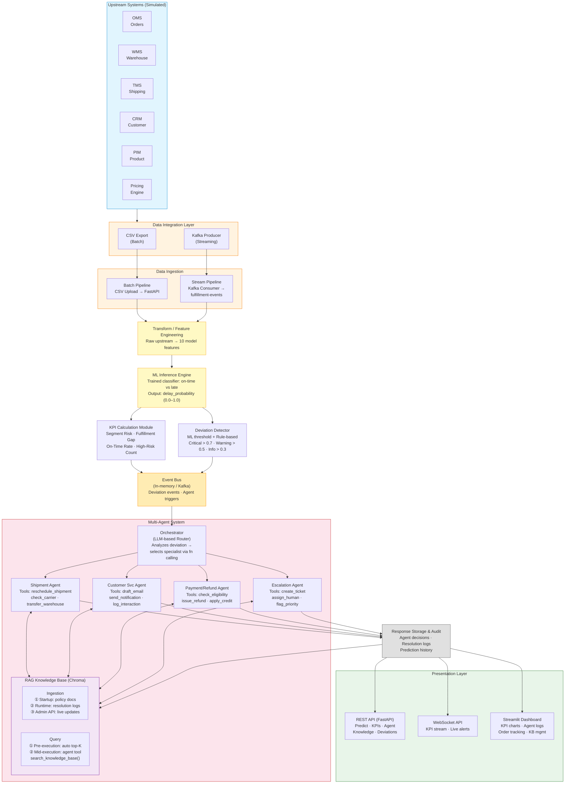

# fulfillment_ai - Architecture Document

## 1. System Overview & Goals

Autonomous AI-driven system for proactive detection and resolution of retail fulfillment operational issues

### Primary Goals
1. **ML-Powered Risk Prediction** - Train and serve a classification model to predict delivery delays
2. **Proactive Risk Detection** - Identify delivery delays before they happen using model predictions + KPIs
3. **Autonomous Resolution** - Trigger AI agents to simulate automatic issue resolution
4. **Operational Visibility** - Real-time KPI monitoring and deviation detection
5. **Extensible Design** - Support multiple agents, KPIs, and data sources

---

## 2. Architecture Diagram



---

## 3. Dataset & Data Pipeline

### 3.1 Kaggle Training Dataset

The [Customer Analytics Dataset](https://www.kaggle.com/datasets/prachi13/customer-analytics) is used to **train the ML model**. It is a **binary classification** problem.

**Schema (10,999 rows, 12 columns):**

| Column | Type | Description |
|--------|------|-------------|
| `ID` | int | Customer ID |
| `Warehouse_block` | cat | Warehouse location (A, B, C, D, E) |
| `Mode_of_Shipment` | cat | Delivery method (Ship, Flight, Road) |
| `Customer_care_calls` | int | Number of support calls for this shipment |
| `Customer_rating` | int | Customer satisfaction (1-5) |
| `Cost_of_the_product` | int | Product cost in USD |
| `Prior_purchases` | int | Number of previous purchases |
| `Product_importance` | cat | Priority level (Low, Medium, High) |
| `Gender` | cat | Customer gender (M/F) |
| `Discount_offered` | int | Discount percentage |
| `Weight_in_gms` | int | Product weight in grams |
| **`Reached.on.Time_Y.N`** | **int** | **Target: 1 = Late, 0 = On-time** |

### 3.2 Upstream Systems (Simulated)

In a real e-commerce company, data flows from multiple operational systems. We simulate a **Data Integration Layer** that consolidates upstream data into a unified schema.

| Upstream System | What It Provides | Mapped Kaggle Features |
|---|---|---|
| **OMS** (Order Management) | Order lifecycle, customer ID, dates | `ID`, simulated `order_date`, `promised_delivery_date` |
| **WMS** (Warehouse Management) | Warehouse assignment, pick/ship dates | `Warehouse_block`, simulated `ship_date` |
| **TMS** (Transport/Carrier) | Shipping mode, carrier, tracking | `Mode_of_Shipment`, simulated `carrier_name`, `tracking_id` |
| **CRM** (Customer Relationship) | Customer profile, support history | `Customer_care_calls`, `Customer_rating`, `Prior_purchases`, `Gender` |
| **PIM** (Product Information) | Product metadata | `Product_importance`, `Weight_in_gms` |
| **Pricing Engine** | Cost, discounts, payment | `Cost_of_the_product`, `Discount_offered`, simulated `payment_status` |

### 3.3 Enriched Input Schema

Both CSV (batch) and Kafka (streaming) use the same enriched schema. This represents what a real Data Integration Layer would produce:

```
order_id              ← OMS
customer_id           ← OMS / CRM
order_date            ← OMS (simulated)
promised_delivery_date← OMS (simulated)
ship_date             ← WMS (simulated, nullable for pending orders)
delivery_date         ← TMS (simulated, nullable for in-transit orders)
warehouse_block       ← WMS
mode_of_shipment      ← TMS
carrier_name          ← TMS (simulated)
customer_care_calls   ← CRM
customer_rating       ← CRM
prior_purchases       ← CRM
gender                ← CRM
product_importance    ← PIM
cost_of_product       ← Pricing
discount_offered      ← Pricing
weight_in_gms         ← PIM
payment_status        ← Pricing (simulated: paid, pending, refunded)
order_status          ← OMS (simulated: processing, shipped, delivered, delayed)
```

### 3.4 Data Pipeline Flow

```
Enriched Input (CSV or Kafka message)
    │
    ▼
Transform / Feature Engineering
    │  - Extract the 10 features the ML model expects
    │  - Encode categoricals (same encoding as training)
    │  - Keep raw fields for KPI calculations
    │
    ├──▶ ML Model Input: [warehouse_block, mode_of_shipment,
    │     customer_care_calls, customer_rating, cost_of_product,
    │     prior_purchases, product_importance, gender,
    │     discount_offered, weight_in_gms]
    │
    ├──▶ ML Inference → delay_probability (0.0 - 1.0)
    │
    ├──▶ KPI Engine (uses raw fields + prediction output)
    │
    └──▶ Deviation Detector (prediction threshold + KPI breaches)
             │
             └──▶ Agent Trigger (if deviation detected)
```

### 3.5 Batch vs Streaming Input

| Aspect | Batch (CSV) | Streaming (Kafka) |
|---|---|---|
| **Source** | CSV file uploaded via API | `fulfillment-events` Kafka topic |
| **Producer** | Assumed external script/ETL that pulls from upstream systems | Kafka Producer Simulator (generates enriched events at configurable intervals) |
| **Consumer** | FastAPI endpoint parses CSV, runs bulk predictions | Kafka Consumer reads events, runs per-record inference |
| **Use Case** | Historical analysis, bulk risk scoring | Real-time monitoring, live delay detection |
| **Output** | CSV/JSON response with predictions + KPIs | Deviation events → agent triggers in real-time |

**Production note:** In a real deployment, upstream systems would publish to their own Kafka topics (e.g., `oms-orders`, `wms-shipments`, `crm-events`). A stream processing layer (Kafka Streams / Flink) would join and enrich these into a unified `fulfillment-events` topic. Our architecture consumes from this unified topic — the Kafka Producer Simulator stands in for that upstream integration layer.

---

## 4. ML Model Training & Serving

### 4.1 Training Pipeline (Jupyter Notebook)

**Responsibility:** Train a binary classifier to predict `Reached.on.Time_Y.N`

**Technology:** scikit-learn, XGBoost/LightGBM, Pandas, Matplotlib/Seaborn
**Notebook:** `notebooks/model_training.ipynb`

**Steps:**
1. **EDA** - Distribution analysis, correlation matrix, class balance check
2. **Feature Engineering** - Encode categoricals (OneHot/Label), scale numerics if needed
3. **Model Selection** - Compare LogisticRegression, RandomForest, XGBoost, LightGBM
4. **Training** - Train/test split (80/20), cross-validation
5. **Evaluation** - Accuracy, Precision, Recall, F1, ROC-AUC, Confusion Matrix
6. **Model Export** - Serialize best model + preprocessing pipeline via `joblib`

**Output Artifacts:**
- `models/delay_classifier.joblib` — trained model
- `models/preprocessor.joblib` — feature preprocessing pipeline (encoders, scalers)
- `models/model_metadata.json` — training metrics, feature names, threshold

### 4.2 Model Serving

**Responsibility:** Load trained model, run inference on new data

**Technology:** joblib, FastAPI

**Serving modes:**
- **Batch:** POST CSV to `/predict/batch` → returns predictions for all rows
- **Streaming:** Kafka consumer deserializes event → calls model → emits prediction
- **Single:** POST JSON to `/predict` → returns prediction for one order

**Model loading:** Model artifacts loaded once at API startup, kept in memory for fast inference.

---

## 5. Component Roles

### 5.1 Data Ingestion & Storage
**Responsibility:** Load, validate, and store enriched order data

**Technology:** Pandas, CSV in-memory cache
**Key Tasks:**
- Accept enriched input (CSV upload or Kafka message)
- Validate schema and handle missing values
- Simulated field generation (dates, payment status, order status) for Kaggle data
- Cache in DataFrame for quick access

---

### 5.2 Transform / Feature Engineering
**Responsibility:** Convert enriched upstream data into ML model input

**Technology:** scikit-learn preprocessor pipeline (joblib)
**Key Tasks:**
- Extract the 10 features the trained model expects
- Apply same encoding/scaling as training (loaded from `preprocessor.joblib`)
- Pass raw fields through for KPI calculations (dates, statuses, etc.)

---

### 5.3 KPI Calculation Module
**Responsibility:** Compute operational KPIs from predictions + raw data

**Technology:** Pandas, NumPy
**KPIs to Implement:**

| KPI | Source | Definition |
|-----|--------|------------|
| **Predicted Delivery Delay** | ML model output | `delay_probability` per order from trained classifier |
| **Segment Risk Score** | Aggregated predictions | Avg delay probability grouped by `warehouse_block`, `mode_of_shipment`, or `product_importance` |
| **Fulfillment Gap** | Raw data + prediction | Orders with `order_status = shipped` and high `delay_probability` (shipped but likely to miss window) |
| **On-Time Delivery Rate** | Aggregated predictions | % of orders with `delay_probability < threshold` per group/period |
| **High-Risk Order Count** | Prediction threshold | Count of orders exceeding delay probability threshold |

**Output:** KPI DataFrame with scores, groupings, and thresholds

---

### 5.4 Risk Detection & Deviation Engine
**Responsibility:** Identify orders that require intervention

**Technology:** Rule-based thresholds on ML predictions
**Logic:**
- `delay_probability > 0.7` → **Critical** — auto-trigger agent
- `delay_probability > 0.5` → **Warning** — flag for review
- `delay_probability > 0.3` → **Info** — monitor
- Combine with KPI breaches (segment risk spikes, fulfillment gap detection)
- Generate deviation events with order context

**Output:** Deviation alerts with order IDs, risk scores, severity, reasons

---

### 5.5 Event Queue / Pub-Sub
**Responsibility:** Route deviation events to agents

**Technology:** Simple in-memory queue (core), Kafka (stretch)
**Behavior:**
- Listens for deviation events from detector
- Queues agent execution requests
- Ensures no duplicate triggers
- Logs all events for audit

---

### 5.6 Multi-Agent Orchestrator
**Responsibility:** Execute autonomous resolution logic via specialized agents
**Technology:** OpenAI API, LangChain

**Why Multi-Agent over Single Agent:**

| Concern | Single Agent | Multi-Agent |
|---|---|---|
| Prompt focus | Diluted across all domains | Sharp, domain-specific per agent |
| Tool access | All tools available (risky) | Scoped per agent (safe) |
| Context window | Grows unbounded across resolutions | Fresh per agent invocation |
| Extensibility | Modify one monolithic agent | Add new agent type, touch nothing |
| Audit trail | One large conversation to parse | Clear per-agent decision logs |
| Parallel execution | Sequential | Concurrent for different deviation types |

**Architecture:**

```
Deviation Event (order context + prediction + severity)
    │
    ▼
Orchestrator (LLM-based Router)
    │  - Receives deviation context
    │  - LLM decides which specialist(s) to invoke (function calling)
    │  - Can invoke multiple agents for one deviation
    │    (e.g., reschedule shipment AND notify customer)
    │
    ├──▶ Shipment Agent
    │     System prompt: shipping policies, carrier SLAs (from RAG)
    │     Tools: reschedule_shipment(), check_carrier_status(), transfer_warehouse()
    │     └── Returns: {action: "rescheduled_to_flight", details: ...}
    │
    ├──▶ Customer Service Agent
    │     System prompt: communication guidelines, tone rules (from RAG)
    │     Tools: draft_email(), send_notification(), log_interaction()
    │     └── Returns: {action: "apology_email_drafted", details: ...}
    │
    ├──▶ Payment/Refund Agent
    │     System prompt: refund policies, compensation tiers (from RAG)
    │     Tools: check_refund_eligibility(), issue_refund(), apply_credit()
    │     └── Returns: {action: "partial_refund_issued", details: ...}
    │
    └──▶ Escalation Agent
          System prompt: escalation criteria, priority rules (from RAG)
          Tools: create_ticket(), assign_human(), flag_priority()
          └── Returns: {action: "escalated_to_human", details: ...}
    │
    ▼
Orchestrator aggregates results → stores decision trail → returns response
```

**Trigger Modes:**
- **Automatic:** Deviation detected (critical severity) → agent fires with no human in the loop
- **Manual:** User calls `POST /trigger-agent` with order/deviation ID for testing

**Multi-Turn Capability:**
Each agent can chain multiple reasoning steps:
1. Analyze order context + retrieved knowledge
2. Decide on action using available tools
3. Execute tool (simulated) → observe result
4. Decide if further action needed → repeat or conclude

**Agent Tool Implementations:**
All tools are real function calls but execute simulated business logic (no actual carrier APIs, payment gateways, or email servers). Each tool returns structured results that the agent reasons over.

---

### 5.7 RAG Knowledge Base
**Responsibility:** Provide dynamic, context-aware knowledge for agent decision-making
**Technology:** LangChain, Chroma (Vector DB), OpenAI Embeddings (`text-embedding-3-small`)
**Storage:** `data/chroma_db/` (persisted to disk)

#### Ingestion Pipeline (3 paths)

**Path 1: Static Policy Documents (at app startup)**

```
knowledge_base/
├── policies/
│   ├── shipping_policy.md
│   ├── refund_policy.md
│   ├── escalation_criteria.md
│   └── communication_guidelines.md
├── slas/
│   ├── carrier_slas.md
│   └── warehouse_slas.md
└── templates/
    ├── apology_email.md
    └── refund_confirmation.md
```

At FastAPI startup (lifespan event):
```
Policy docs → LangChain TextSplitter (chunk) → OpenAI Embedding → Chroma (persist)
```
Runs once on first startup. Subsequent startups load existing Chroma store from disk.

**Path 2: Historical Resolutions (at runtime, after each agent action)**

After every agent resolution, the decision is ingested back into the knowledge base:
```
Agent completes resolution
    │
    ▼
Resolution document created:
    "Order #1234 | Warehouse B | Road | 4200g | delay_prob=0.85
     Severity: Critical
     Agent: Shipment Agent
     Resolution: Upgraded to Flight, customer notified
     Outcome: Resolved"
    │
    ▼
Embed → Store in Chroma (metadata: agent_type, severity, warehouse, shipment_mode)
```

This creates a **growing knowledge base** — agents retrieve past resolutions for similar orders to inform decisions.

**Path 3: Admin API (on demand)**
```
POST /knowledge/ingest
Body: { "content": "New policy: Free shipping upgrade for delays >3 days",
        "category": "shipping_policy" }
    │
    ▼
Chunk → Embed → Store in Chroma with metadata
```

Allows policy updates without redeploying the application.

#### Query Pipeline (2 modes)

**Pre-execution Retrieval (automatic, before every agent call):**

```
Orchestrator routes deviation to Shipment Agent
    │
    ▼
Query constructed from deviation context:
    "shipping delay warehouse B road shipment 4200g high discount"
    │
    ▼
Chroma similarity search (top-5, filtered by metadata for agent type)
    │
    ▼
Retrieved docs injected into agent prompt:
    "You are the Shipment Agent. Use the following knowledge:
     [1] Shipping Policy: Road shipments >4000g qualify for mode upgrade...
     [2] Warehouse B SLA: Current processing time 3.2 days...
     [3] Historical: Order #890 (similar profile) resolved via Flight upgrade...

     Deviation: {order context + prediction details}

     Decide and act using your available tools."
```

**Mid-execution Retrieval (agent tool, on-demand during reasoning):**

Agents have a `search_knowledge_base(query)` tool they can call during multi-turn reasoning:
```
Agent Turn 1: "This order has 65% discount. Let me check refund eligibility."
    → Calls: search_knowledge_base("refund eligibility high discount order")
    → Gets: "Policy: Orders with >50% discount have modified refund terms..."
Agent Turn 2: "Per policy, partial refund only. Issuing 50% store credit."
    → Calls: apply_credit(order_id=1234, amount=...)
```

#### Knowledge Types & Agent Mapping

| Knowledge Type | Documents | Primary Consumer |
|---|---|---|
| Shipping Policies | Mode upgrade rules, weight limits, carrier selection | Shipment Agent |
| Carrier SLAs | Delivery time guarantees, performance metrics | Shipment Agent |
| Warehouse SLAs | Processing times, capacity alerts | Shipment Agent |
| Refund Policies | Eligibility rules, compensation tiers, approval limits | Payment Agent |
| Communication Guidelines | Tone rules, escalation language, template selection | Customer Agent |
| Escalation Criteria | When to escalate, priority levels, routing rules | Escalation Agent |
| Historical Resolutions | Past decisions + outcomes (auto-ingested) | All agents |

---

### 5.8 REST API Layer
**Responsibility:** Expose system functionality via HTTP
**Technology:** FastAPI with Swagger documentation
**Endpoints:**

| Endpoint | Method | Purpose |
|----------|--------|---------|
| `/health` | GET | System health check |
| `/predict` | POST | Single order prediction (JSON) |
| `/predict/batch` | POST | Bulk predictions (CSV upload) |
| `/kpi/compute` | POST | Trigger KPI calculation on dataset |
| `/kpi/dashboard` | GET | View current KPI values |
| `/detect-deviation` | POST | Run deviation detection |
| `/deviations` | GET | List recent deviations |
| `/trigger-agent` | POST | Manually trigger agent on deviation |
| `/agent-response/{id}` | GET | Fetch agent resolution output |
| `/orders/{id}` | GET | Order status + prediction + KPI details |
| `/knowledge/ingest` | POST | Add document to RAG knowledge base |
| `/knowledge/search` | POST | Query knowledge base (for debugging/admin) |

---

### 5.9 Streaming Pipeline 
**Responsibility:** Real-time predictions and KPI updates from live data
**Technology:** Kafka, APScheduler, WebSocket (FastAPI)
**Architecture:**
- **Kafka Producer Simulator** — Generates enriched order events, publishes to `fulfillment-events` topic
- **Kafka Consumer** — Reads events → transform → ML inference → deviation check → agent trigger
- **KPI Streaming** — Aggregated KPIs published to `kpi-updates` topic, pushed to clients via WebSocket
- **APScheduler** — Periodic KPI recalculation over sliding windows

---

### 5.10 Monitoring Dashboard 
**Responsibility:** Visual monitoring and manual intervention interface

**Technology:** Streamlit, Plotly, Pandas
**Features:**
- Real-time KPI visualization (charts, gauges)
- Deviation alerts (color-coded severity)
- Agent decision logs (searchable, filterable)
- Order tracking with prediction scores
- Manual agent triggering (for testing)
- Knowledge base management (view ingested docs, add new policies)

**Views:**
- Dashboard (KPI summary, alerts, stats)
- Orders (search, filter, drill-down with prediction details)
- Agents (execution logs, decision trails)
- Knowledge Base (view documents, add policies, search)
- Settings (thresholds, configuration)

---

### 5.11 Logging & Monitoring
**Responsibility:** Audit trail, error tracking, performance metrics

**Technology:** Python logging, structured JSON logs
**Logs:**
- All predictions with input features and output probabilities
- KPI calculations with timestamps
- Deviation events with severity & context
- Agent triggers, decisions, and outputs
- RAG retrievals (query, retrieved docs, relevance scores)
- Knowledge base ingestion events
- API requests/responses with latency

---

## 6. Tech Stack Justification

### Core Stack
| Layer | Technology | Justification |
|-------|-----------|---------------|
| **ML Training** | scikit-learn, XGBoost/LightGBM | Industry-standard for tabular classification; fast training |
| **ML Serving** | joblib + FastAPI | Lightweight model loading; no separate serving infra needed |
| **Data Processing** | Pandas, NumPy | Fast, familiar DSL for tabular data; ideal for CSV |
| **API** | FastAPI | Async, auto-docs (Swagger), lightweight, modern |
| **AI Agents** | OpenAI API + LangChain | State-of-the-art LLM capabilities; abstracts prompt logic |
| **RAG Vector DB** | Chroma | Lightweight, in-process, persisted to disk; no external service needed |
| **RAG Embeddings** | OpenAI text-embedding-3-small | High-quality semantic search; same API key as agents |
| **Containerization** | Docker + Docker Compose | Cloud-native, reproducible environments |
| **Notebook** | Jupyter | Standard for EDA and ML experimentation |
| **Testing** | pytest | Comprehensive, fixtures, plugin ecosystem |

### Stretch Goal Stack
| Component | Technology | Justification |
|-----------|-----------|---------------|
| **Streaming** | Kafka (Docker) | Distributed event streaming; industry standard |
| **Real-time Push** | FastAPI WebSocket | Native async support; lightweight real-time |
| **Dashboard** | Streamlit + Plotly | Rapid development; interactive visualizations |
| **Scheduler** | APScheduler | Lightweight; periodic KPI recalculation |

---

## 7. Deployment Setup

### 7.1 Local Development
```bash
# Clone repo
git clone https://github.com/scriperdj/fulfillment_ai.git
cd fulfillment_ai

# Create venv
python3 -m venv venv
source venv/bin/activate

# Install deps
pip install -r requirements.txt

# Train model (first time)
jupyter notebook notebooks/model_training.ipynb

# Run API
uvicorn src.api:app --reload

# Run tests
pytest tests/
```

### 7.2 Docker Deployment
```bash
# Full stack (API + Kafka + Streamlit)
docker-compose up -d

# API only
docker-compose up api
```

### 7.3 Production Considerations
- Environment-based config (`.env` files)
- API key management (secrets, not in code)
- Model versioning and A/B testing
- CI/CD pipeline (GitHub Actions)
- Monitoring & alerting setup

---

## 8. Assumptions & Limitations

### Assumptions
1. **Dataset for Training** - Kaggle dataset is used solely to train the ML model; inference runs on new enriched data
2. **Simulated Upstream Data** - Enriched fields (dates, statuses) are synthetically generated to simulate real upstream systems
3. **Simulated Agent Tools** - Agent tools (reschedule, refund, email) execute simulated business logic, not real integrations
4. **Real RAG Workflow** - Policy documents are real (shipped in repo), embeddings are real (OpenAI API), retrieval is real (Chroma similarity search)
5. **No Authentication** - Open API for demo (add OAuth in production)
6. **Kafka via Docker** - Kafka cluster runs in Docker Compose for streaming features

### Limitations
1. **Model Accuracy** - Bounded by Kaggle dataset quality and feature set
2. **No Real Timestamps** - Kaggle data lacks dates; simulated timestamps won't capture real seasonal patterns
3. **Single Model** - One classifier for all segments (could train per-segment models in v2)
4. **Knowledge Base Scope** - Policy documents are representative examples; production would have full company knowledge
5. **Streaming Simulation** - Kafka producer generates synthetic events, not real upstream data
6. **Dashboard Scalability** - Streamlit designed for single concurrent user

---

## 9. Implementation Scope

### Core Features (MVP)
- ML model training notebook (EDA + training + evaluation + export)
- Data ingestion with enriched schema + transform layer
- ML inference serving (batch CSV + single prediction)
- KPI calculation from predictions + raw data
- Deviation detection (ML threshold + rule-based)
- Multi-agent orchestrator with LLM-based routing (shipment, customer, payment, escalation)
- Agent tools with simulated business logic
- RAG knowledge base (real ingestion + retrieval with Chroma + OpenAI Embeddings)
- Policy documents + historical resolution ingestion
- REST API (FastAPI)
- Docker setup

### Stretch Goals
- Kafka streaming pipeline (producer simulator + consumer + live inference)
- Streaming KPI updates (Kafka + WebSocket)
- Streamlit monitoring dashboard

### Future Extensions (v2+)
- Per-segment ML models
- Email/SMS integration for customer communication
- Resilience, fault tolerance, and scalability

