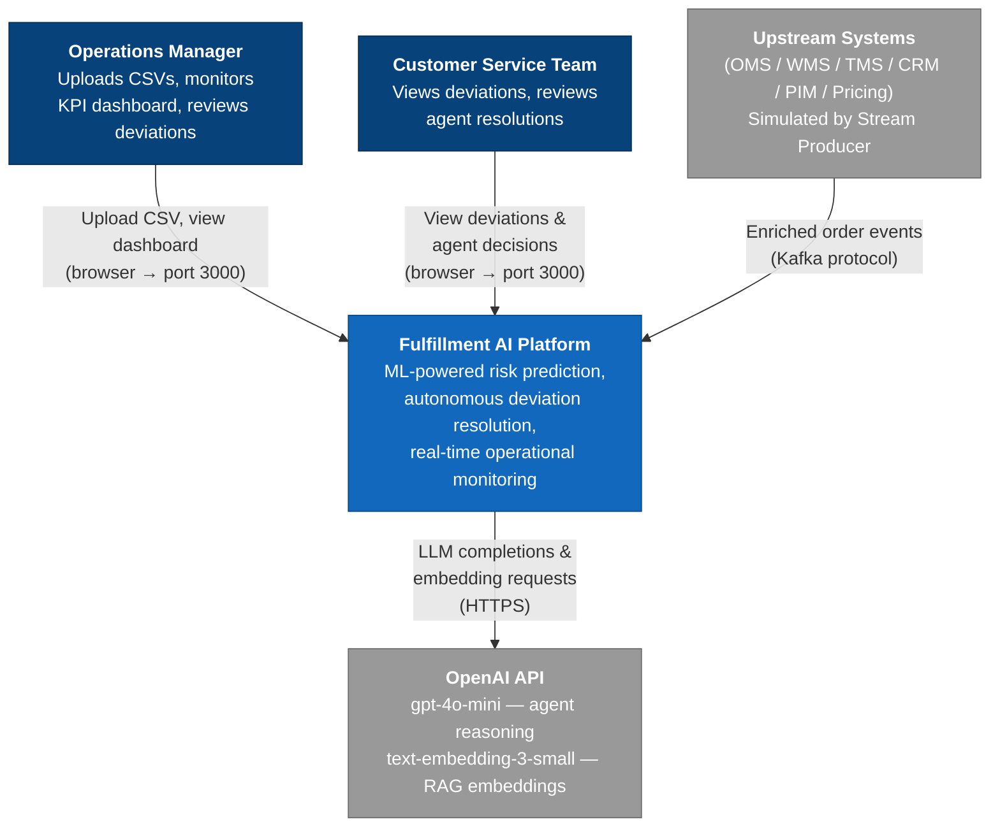
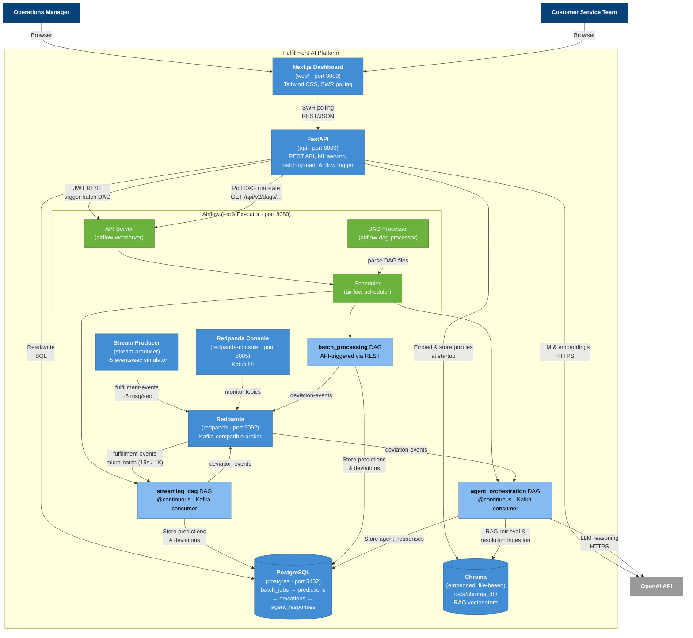
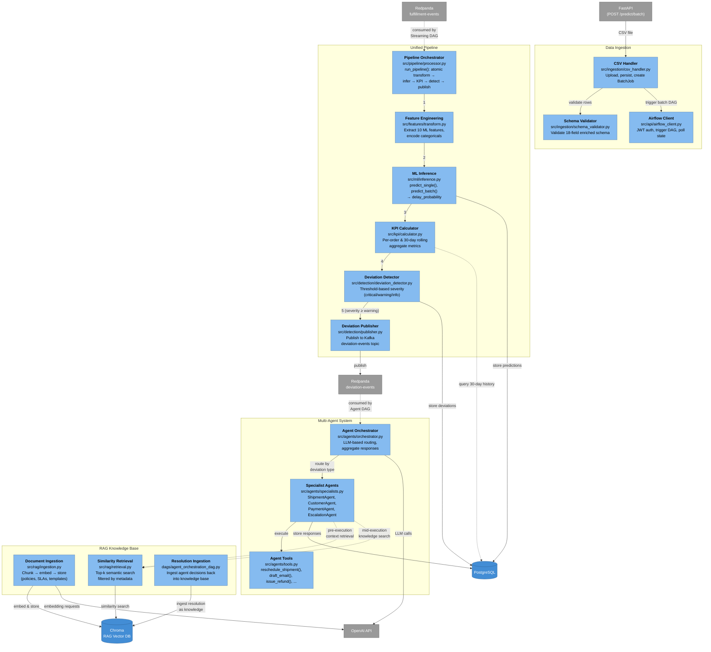

# fulfillment_ai - Architecture Document

## 1. System Overview & Goals

Autonomous AI-driven system for proactive detection and resolution of retail fulfillment operational issues

### Primary Goals
1. **ML-Powered Risk Prediction** - Train and serve a classification model to predict delivery delays
2. **Proactive Risk Detection** - Identify delivery delays before they happen using model predictions + KPIs
3. **Autonomous Resolution** - Trigger AI agents to simulate automatic issue resolution
4. **Operational Visibility** - Real-time KPI monitoring and deviation detection
5. **Extensible Design** - Support multiple agents, KPIs, and data sources

---

## 2. Architecture Diagrams

Three levels of C4-style diagrams — from high-level system context down to internal component detail.

### 2.1 Level 1 — System Context

Shows the platform as a single box with the external actors and systems it interacts with.



### 2.2 Level 2 — Container Diagram

Shows all runtime containers, data stores, and the data flows between them.



#### Container Summary

| Container | Image / Build | Port | Role |
|-----------|--------------|------|------|
| **postgres** | `postgres:16-alpine` | 5432 | Shared DB — Airflow metadata + app tables |
| **redpanda** | `redpandadata/redpanda:latest` | 9092 | Kafka-compatible broker (2 topics) |
| **redpanda-console** | `redpandadata/console:latest` | 8085 | Kafka topic monitoring UI |
| **api** | Custom (FastAPI) | 8000 | REST API, ML serving, batch upload, Airflow trigger |
| **airflow-webserver** | Custom (Airflow) | 8080 | Airflow API server (REST + UI) |
| **airflow-scheduler** | Custom (Airflow) | — | DAG scheduling & task execution |
| **airflow-dag-processor** | Custom (Airflow) | — | DAG file parsing |
| **stream-producer** | Custom (Python) | — | Simulates upstream systems (~5 events/sec) |
| **web** (Next.js) | `web/` directory | 3000 | Operations dashboard |

#### Kafka Topics

| Topic | Producer | Consumer |
|-------|----------|----------|
| `fulfillment-events` | Stream Producer | Streaming DAG (micro-batch) |
| `deviation-events` | Batch DAG, Streaming DAG | Agent Orchestration DAG |

### 2.3 Level 3 — Component Diagram (Processing & Intelligence Core)

Zooms into the shared Python codebase (`src/`) showing the 4 major component groups and their interactions.



#### Component Summary

| Group | Component | Source File | Responsibility |
|-------|-----------|-------------|----------------|
| **Data Ingestion** | CSV Handler | `src/ingestion/csv_handler.py` | Upload CSV, persist to disk, create BatchJob record |
| | Schema Validator | `src/ingestion/schema_validator.py` | Validate 18-field enriched order schema |
| | Airflow Client | `src/api/airflow_client.py` | JWT-authenticated REST calls to trigger/poll Airflow DAGs |
| **Unified Pipeline** | Feature Engineering | `src/features/transform.py` | Extract 10 ML features, encode categoricals |
| | ML Inference | `src/ml/inference.py` | Batch/single prediction → `delay_probability` |
| | KPI Calculator | `src/kpi/calculator.py` | Per-order scores + 30-day rolling aggregates |
| | Deviation Detector | `src/detection/deviation_detector.py` | Threshold-based severity classification |
| | Deviation Publisher | `src/detection/publisher.py` | Publish deviation events to Kafka |
| | Pipeline Orchestrator | `src/pipeline/processor.py` | `run_pipeline()` — atomic transform → infer → KPI → detect → publish |
| **Multi-Agent System** | Agent Orchestrator | `src/agents/orchestrator.py` | LLM-based routing to specialist agents |
| | Specialist Agents | `src/agents/specialists.py` | ShipmentAgent, CustomerAgent, PaymentAgent, EscalationAgent |
| | Agent Tools | `src/agents/tools.py` | Simulated business actions (reschedule, email, refund, escalate) |
| **RAG Knowledge Base** | Document Ingestion | `src/rag/ingestion.py` | Chunk, embed, store policies/SLAs into Chroma |
| | Similarity Retrieval | `src/rag/retrieval.py` | Top-k semantic search filtered by metadata |
| | Resolution Ingestion | `dags/agent_orchestration_dag.py` | Feed agent decisions back into Chroma as knowledge |

---

## 3. Dataset & Data Pipeline

### 3.1 Kaggle Training Dataset

The [Customer Analytics Dataset](https://www.kaggle.com/datasets/prachi13/customer-analytics) is used to **train the ML model**. It is a **binary classification** problem.

**Schema (10,999 rows, 12 columns):**

| Column | Type | Description |
|--------|------|-------------|
| `ID` | int | Customer ID |
| `Warehouse_block` | cat | Warehouse location (A, B, C, D, E) |
| `Mode_of_Shipment` | cat | Delivery method (Ship, Flight, Road) |
| `Customer_care_calls` | int | Number of support calls for this shipment |
| `Customer_rating` | int | Customer satisfaction (1-5) |
| `Cost_of_the_product` | int | Product cost in USD |
| `Prior_purchases` | int | Number of previous purchases |
| `Product_importance` | cat | Priority level (Low, Medium, High) |
| `Gender` | cat | Customer gender (M/F) |
| `Discount_offered` | int | Discount percentage |
| `Weight_in_gms` | int | Product weight in grams |
| **`Reached.on.Time_Y.N`** | **int** | **Target: 1 = Late, 0 = On-time** |

### 3.2 Upstream Systems (Simulated)

In a real e-commerce company, data flows from multiple operational systems. We simulate a **Data Integration Layer** that consolidates upstream data into a unified schema.

| Upstream System | What It Provides | Mapped Kaggle Features |
|---|---|---|
| **OMS** (Order Management) | Order lifecycle, customer ID, dates | `ID`, simulated `order_date`, `promised_delivery_date` |
| **WMS** (Warehouse Management) | Warehouse assignment, pick/ship dates | `Warehouse_block`, simulated `ship_date` |
| **TMS** (Transport/Carrier) | Shipping mode, carrier, tracking | `Mode_of_Shipment`, simulated `carrier_name`, `tracking_id` |
| **CRM** (Customer Relationship) | Customer profile, support history | `Customer_care_calls`, `Customer_rating`, `Prior_purchases`, `Gender` |
| **PIM** (Product Information) | Product metadata | `Product_importance`, `Weight_in_gms` |
| **Pricing Engine** | Cost, discounts, payment | `Cost_of_the_product`, `Discount_offered`, simulated `payment_status` |

### 3.3 Enriched Input Schema

Both CSV (batch) and Kafka (streaming) use the same enriched schema. This represents what a real Data Integration Layer would produce:

```
order_id              ← OMS
customer_id           ← OMS / CRM
order_date            ← OMS (simulated)
promised_delivery_date← OMS (simulated)
ship_date             ← WMS (simulated, nullable for pending orders)
delivery_date         ← TMS (simulated, nullable for in-transit orders)
warehouse_block       ← WMS
mode_of_shipment      ← TMS
carrier_name          ← TMS (simulated)
customer_care_calls   ← CRM
customer_rating       ← CRM
prior_purchases       ← CRM
gender                ← CRM
product_importance    ← PIM
cost_of_product       ← Pricing
discount_offered      ← Pricing
weight_in_gms         ← PIM
payment_status        ← Pricing (simulated: paid, pending, refunded)
order_status          ← OMS (simulated: processing, shipped, delivered, delayed)
```

### 3.4 Unified Processing Pipeline

Transform → Inference → KPI → Deviation runs as a **single atomic job**. The same pipeline code is used by both batch and streaming paths.

```
Enriched Input (CSV or Kafka message)
    │
    ▼
┌─────────────────────────────────────────────────────┐
│  Unified Processing Pipeline (single job)           │
│                                                     │
│  1. Transform / Feature Engineering                 │
│     - Extract 10 model features                     │
│     - Encode categoricals (same as training)        │
│     - Keep raw fields for KPI calculations          │
│                                                     │
│  2. ML Inference                                    │
│     - Input: [warehouse_block, mode_of_shipment,    │
│       customer_care_calls, customer_rating,         │
│       cost_of_product, prior_purchases,             │
│       product_importance, gender,                   │
│       discount_offered, weight_in_gms]              │
│     - Output: delay_probability (0.0 - 1.0)        │
│                                                     │
│  3. Store prediction → Postgres (predictions table)  │
│                                                     │
│  4. KPI Engine                                      │
│     - Running averages from historical + current    │
│     - Query Postgres predictions for cumulative     │
│       metrics                                       │
│                                                     │
│  5. Deviation Detector                              │
│     - ML threshold + KPI breach check               │
│     - If deviation: publish to Kafka                 │
│       deviation-events topic                        │
└─────────────────────────────────────────────────────┘
    │
    ▼
Kafka deviation-events → Airflow Agent DAG → Orchestrator → Agents
```

**Execution context:**
- **Batch:** Airflow Batch DAG triggers pipeline as a task (CSV → process all rows → deviations to Kafka)
- **Streaming:** Airflow Streaming DAG consumes `fulfillment-events` via Kafka trigger, collects micro-batches (15s / 1K max) → runs pipeline in bulk → deviations to Kafka

### 3.5 Batch vs Streaming Input

| Aspect | Batch (CSV) | Streaming (Kafka) |
|---|---|---|
| **Source** | CSV file uploaded via API | `fulfillment-events` Kafka topic |
| **Producer** | Assumed external script/ETL that pulls from upstream systems | Kafka Producer Simulator (generates enriched events at configurable intervals) |
| **Orchestration** | Airflow Batch DAG triggered by API upload | Airflow Streaming DAG with Kafka consumer trigger (runs continuously) |
| **Processing** | Airflow task calls unified pipeline on all rows | Airflow task collects micro-batch (15s / 1K max) → pipeline in bulk |
| **Use Case** | Historical analysis, bulk risk scoring | Real-time monitoring, live delay detection |
| **Output** | CSV/JSON response with predictions + KPIs | Deviation events to Kafka → Airflow Agent DAG |

**Production note:** In a real deployment, upstream systems would publish to their own topics (e.g., `oms-orders`, `wms-shipments`, `crm-events`). A stream processing layer (Kafka Streams / Flink) would join and enrich these into a unified `fulfillment-events` topic. Our architecture consumes from this unified topic — the Kafka Producer Simulator stands in for that upstream integration layer.

---

## 4. ML Model Training & Serving

### 4.1 Training Pipeline (Jupyter Notebook)

**Responsibility:** Train a binary classifier to predict `Reached.on.Time_Y.N`

**Technology:** scikit-learn, XGBoost/LightGBM, Pandas, Matplotlib/Seaborn
**Notebook:** `notebooks/model_training.ipynb`

**Steps:**
1. **EDA** - Distribution analysis, correlation matrix, class balance check
2. **Feature Engineering** - Encode categoricals (OneHot/Label), scale numerics if needed
3. **Model Selection** - Compare LogisticRegression, RandomForest, XGBoost, LightGBM
4. **Training** - Train/test split (80/20), cross-validation
5. **Evaluation** - Accuracy, Precision, Recall, F1, ROC-AUC, Confusion Matrix
6. **Model Export** - Serialize best model + preprocessing pipeline via `joblib`

**Output Artifacts:**
- `models/delay_classifier.joblib` — trained model
- `models/preprocessor.joblib` — feature preprocessing pipeline (encoders, scalers)
- `models/model_metadata.json` — training metrics, feature names, threshold

### 4.2 Model Serving

**Responsibility:** Load trained model, run inference on new data

**Technology:** joblib, FastAPI

**Serving modes:**
- **Batch:** POST CSV to `/predict/batch` → async (returns `batch_job_id`) → Airflow DAG runs pipeline → results in Postgres
- **Streaming:** Airflow Streaming DAG consumes from Kafka → calls model → stores prediction in Postgres → deviations to Kafka
- **Single:** POST JSON to `/predict` → synchronous, returns prediction immediately

**Model loading:** Model artifacts loaded once at startup (API and Airflow workers), kept in memory for fast inference.

---

## 5. Component Roles

### 5.1 Data Ingestion & Storage
**Responsibility:** Load, validate, store, and track enriched order data

**Technology:** Pandas, PostgreSQL, FastAPI

#### Batch (CSV) Workflow

The CSV upload is **asynchronous** — the API returns immediately with a `batch_job_id`, and Airflow processes the data in the background.

```
POST /predict/batch (CSV file)
    │
    ▼
API: save CSV to disk, create batch_job record in Postgres (status: pending)
    │  Returns: { batch_job_id: "abc-123" }
    │
    ▼
Trigger Airflow Batch Processing DAG (batch_job_id)
    │
    ▼
Airflow DAG:
    1. Load CSV by batch_job_id
    2. Validate schema, handle missing values
    3. Run unified pipeline (transform → inference → KPI → deviation)
    4. Store predictions in Postgres (FK → batch_job_id)
    5. Store deviations in Postgres (FK → prediction_id)
    6. Critical deviations → publish to Kafka deviation-events
    7. Update batch_job status: completed
    │
    ▼
Kafka deviation-events → Airflow Agent DAG
    1. Agent orchestrator runs
    2. Agent responses stored in Postgres (FK → deviation_id)
    3. Agent responses also ingested into RAG (Chroma)
    │
    ▼
User queries results:
    GET /batch/{id}/status           → pending / processing / completed / failed
    GET /batch/{id}/predictions      → all predictions for this upload
    GET /batch/{id}/deviations       → all deviations detected
    GET /batch/{id}/agent-responses  → all agent actions triggered
```

#### Streaming (Kafka) Workflow — Micro-Batch via Airflow

Airflow 3.x natively supports Kafka consumers as DAG triggers. The **Streaming DAG** runs continuously inside Airflow, consuming from `fulfillment-events` in micro-batches. This eliminates a standalone consumer service and unifies all orchestration in Airflow.

```
Kafka fulfillment-events topic
    │
    ▼
Airflow Streaming DAG (Kafka consumer trigger):
    Collect messages until:
      - 15 seconds elapsed, OR
      - 1,000 messages buffered
      (whichever comes first)
    │
    ▼
Process micro-batch in bulk:
    1. Deserialize all messages into DataFrame
    2. Run unified pipeline on entire batch (same code as CSV batch)
    3. Store all predictions in Postgres (source=streaming, batch_job_id=NULL)
    4. Store all deviations in Postgres (FK → prediction_id)
    5. Critical deviations → bulk publish to Kafka deviation-events
    │
    ▼
Kafka deviation-events → Airflow Agent DAG (same as batch)
    │
    ▼
Query by order_id, deviation_id, or time range
```

**Why micro-batch over per-message:**
- Vectorized inference (model.predict on DataFrame vs one row at a time)
- Bulk DB inserts (single INSERT with many rows)
- KPI running averages computed once per micro-batch, not per message
- Bounded latency: worst-case 15s delay, acceptable for near-real-time use case

#### Common Data Chain

Both batch and streaming produce the same FK chain in Postgres:

```
batch_jobs (batch only)
    ↓ batch_job_id
predictions (order_id, source=batch|streaming, delay_probability)
    ↓ prediction_id
deviations (severity, reason, status)
    ↓ deviation_id
agent_responses (agent_type, action, details, conversation_history)
```

- **Batch queries:** filter by `batch_job_id` to get all results for a CSV upload
- **Streaming queries:** filter by `order_id`, `time range`, or `deviation_id`

---

### 5.2 Transform / Feature Engineering
**Responsibility:** Convert enriched upstream data into ML model input

**Technology:** scikit-learn preprocessor pipeline (joblib)
**Key Tasks:**
- Extract the 10 features the trained model expects
- Apply same encoding/scaling as training (loaded from `preprocessor.joblib`)
- Pass raw fields through for KPI calculations (dates, statuses, etc.)

---

### 5.3 KPI Calculation Module
**Responsibility:** Compute operational KPIs from predictions + historical data

**Technology:** Pandas, NumPy, PostgreSQL
**KPIs to Implement:**

| KPI | Type | Definition |
|-----|------|------------|
| **Predicted Delivery Delay** | Per-order | `delay_probability` from trained classifier (current prediction) |
| **Segment Risk Score** | Running average (30-day) | Avg delay probability grouped by `warehouse_block`, `mode_of_shipment`, or `product_importance` — rolling 30-day window |
| **Fulfillment Gap** | Per-order | Orders with `order_status = shipped` and high `delay_probability` (shipped but likely to miss window) |
| **On-Time Delivery Rate** | Running average (30-day) | % of orders with `delay_probability < threshold` per group — rolling 30-day window |
| **High-Risk Order Count** | Running count (30-day) | Count of orders exceeding delay probability threshold in last 30 days |

**Historical Storage (PostgreSQL):**
Running average KPIs query the `predictions` table with a **30-day rolling window** (`WHERE created_at > NOW() - INTERVAL '30 days'`). This bounds query cost and ensures KPIs reflect recent operational health rather than stale historical patterns. See Section 5.8 for full DB schema.

**Output:** KPI DataFrame with per-order scores + aggregated running metrics

---

### 5.4 Risk Detection & Deviation Engine
**Responsibility:** Identify orders that require intervention

**Technology:** Rule-based thresholds on ML predictions
**Logic:**
- `delay_probability > 0.7` → **Critical** — auto-trigger agent
- `delay_probability > 0.5` → **Warning** — flag for review
- `delay_probability > 0.3` → **Info** — monitor
- Combine with KPI breaches (segment risk spikes, fulfillment gap detection)
- Generate deviation events with order context

**Output:** Deviation alerts with order IDs, risk scores, severity, reasons

---

### 5.5 Kafka Event Routing
**Responsibility:** Route deviation events from processing pipeline to agent orchestration

**Technology:** Kafka (Redpanda — see Tech Stack)
**Topics:**
- `fulfillment-events` — Enriched order data from upstream (input)
- `deviation-events` — Deviations detected by pipeline (triggers agent orchestration)

**Behavior:**
- Processing pipeline publishes deviation events to `deviation-events` topic
- Airflow Agent DAG uses Kafka consumer trigger on `deviation-events` → triggers orchestrator
- Ensures no duplicate triggers (consumer group + idempotent processing)
- All events retained for audit and replay

---

### 5.6 Multi-Agent Orchestrator
**Responsibility:** Execute autonomous resolution logic via specialized agents
**Technology:** OpenAI API, LangChain

**Why Multi-Agent over Single Agent:**

| Concern | Single Agent | Multi-Agent |
|---|---|---|
| Prompt focus | Diluted across all domains | Sharp, domain-specific per agent |
| Tool access | All tools available (risky) | Scoped per agent (safe) |
| Context window | Grows unbounded across resolutions | Fresh per agent invocation |
| Extensibility | Modify one monolithic agent | Add new agent type, touch nothing |
| Audit trail | One large conversation to parse | Clear per-agent decision logs |
| Parallel execution | Sequential | Concurrent for different deviation types |

**Architecture:**

```
Deviation Event (order context + prediction + severity)
    │
    ▼
Orchestrator (LLM-based Router)
    │  - Receives deviation context
    │  - LLM decides which specialist(s) to invoke (function calling)
    │  - Can invoke multiple agents for one deviation
    │    (e.g., reschedule shipment AND notify customer)
    │
    ├──▶ Shipment Agent
    │     System prompt: shipping policies, carrier SLAs (from RAG)
    │     Tools: reschedule_shipment(), check_carrier_status(), transfer_warehouse()
    │     └── Returns: {action: "rescheduled_to_flight", details: ...}
    │
    ├──▶ Customer Service Agent
    │     System prompt: communication guidelines, tone rules (from RAG)
    │     Tools: draft_email(), send_notification(), log_interaction()
    │     └── Returns: {action: "apology_email_drafted", details: ...}
    │
    ├──▶ Payment/Refund Agent
    │     System prompt: refund policies, compensation tiers (from RAG)
    │     Tools: check_refund_eligibility(), issue_refund(), apply_credit()
    │     └── Returns: {action: "partial_refund_issued", details: ...}
    │
    └──▶ Escalation Agent
          System prompt: escalation criteria, priority rules (from RAG)
          Tools: create_ticket(), assign_human(), flag_priority()
          └── Returns: {action: "escalated_to_human", details: ...}
    │
    ▼
Orchestrator aggregates results → stores decision trail → returns response
```

**Trigger Modes:**
- **Automatic:** Deviation published to Kafka → Airflow Agent DAG picks it up → orchestrator fires with no human in the loop
- **Manual:** User calls `POST /trigger-agent` with order/deviation ID → triggers Airflow agent DAG directly

**Multi-Turn Capability:**
Each agent can chain multiple reasoning steps:
1. Analyze order context + retrieved knowledge
2. Decide on action using available tools
3. Execute tool (simulated) → observe result
4. Decide if further action needed → repeat or conclude

**Agent Tool Implementations:**
All tools are real function calls but execute simulated business logic (no actual carrier APIs, payment gateways, or email servers). Each tool returns structured results that the agent reasons over.

---

### 5.7 RAG Knowledge Base
**Responsibility:** Provide dynamic, context-aware knowledge for agent decision-making
**Technology:** LangChain, Chroma (Vector DB), OpenAI Embeddings (`text-embedding-3-small`)
**Storage:** `data/chroma_db/` (persisted to disk)

#### Ingestion Pipeline (3 paths)

**Path 1: Static Policy Documents (at app startup)**

```
knowledge_base/
├── policies/
│   ├── shipping_policy.md
│   ├── refund_policy.md
│   ├── escalation_criteria.md
│   └── communication_guidelines.md
├── slas/
│   ├── carrier_slas.md
│   └── warehouse_slas.md
└── templates/
    ├── apology_email.md
    └── refund_confirmation.md
```

At FastAPI startup (lifespan event):
```
Policy docs → LangChain TextSplitter (chunk) → OpenAI Embedding → Chroma (persist)
```
Runs once on first startup. Subsequent startups load existing Chroma store from disk.

**Path 2: Historical Resolutions (at runtime, after each agent action)**

After every agent resolution, the decision is ingested back into the knowledge base:
```
Agent completes resolution
    │
    ▼
Resolution document created:
    "Order #1234 | Warehouse B | Road | 4200g | delay_prob=0.85
     Severity: Critical
     Agent: Shipment Agent
     Resolution: Upgraded to Flight, customer notified
     Outcome: Resolved"
    │
    ▼
Embed → Store in Chroma (metadata: agent_type, severity, warehouse, shipment_mode)
```

This creates a **growing knowledge base** — agents retrieve past resolutions for similar orders to inform decisions.

**Path 3: Admin API (on demand)**
```
POST /knowledge/ingest
Body: { "content": "New policy: Free shipping upgrade for delays >3 days",
        "category": "shipping_policy" }
    │
    ▼
Chunk → Embed → Store in Chroma with metadata
```

Allows policy updates without redeploying the application.

#### Query Pipeline (2 modes)

**Pre-execution Retrieval (automatic, before every agent call):**

```
Orchestrator routes deviation to Shipment Agent
    │
    ▼
Query constructed from deviation context:
    "shipping delay warehouse B road shipment 4200g high discount"
    │
    ▼
Chroma similarity search (top-5, filtered by metadata for agent type)
    │
    ▼
Retrieved docs injected into agent prompt:
    "You are the Shipment Agent. Use the following knowledge:
     [1] Shipping Policy: Road shipments >4000g qualify for mode upgrade...
     [2] Warehouse B SLA: Current processing time 3.2 days...
     [3] Historical: Order #890 (similar profile) resolved via Flight upgrade...

     Deviation: {order context + prediction details}

     Decide and act using your available tools."
```

**Mid-execution Retrieval (agent tool, on-demand during reasoning):**

Agents have a `search_knowledge_base(query)` tool they can call during multi-turn reasoning:
```
Agent Turn 1: "This order has 65% discount. Let me check refund eligibility."
    → Calls: search_knowledge_base("refund eligibility high discount order")
    → Gets: "Policy: Orders with >50% discount have modified refund terms..."
Agent Turn 2: "Per policy, partial refund only. Issuing 50% store credit."
    → Calls: apply_credit(order_id=1234, amount=...)
```

#### Knowledge Types & Agent Mapping

| Knowledge Type | Documents | Primary Consumer |
|---|---|---|
| Shipping Policies | Mode upgrade rules, weight limits, carrier selection | Shipment Agent |
| Carrier SLAs | Delivery time guarantees, performance metrics | Shipment Agent |
| Warehouse SLAs | Processing times, capacity alerts | Shipment Agent |
| Refund Policies | Eligibility rules, compensation tiers, approval limits | Payment Agent |
| Communication Guidelines | Tone rules, escalation language, template selection | Customer Agent |
| Escalation Criteria | When to escalate, priority levels, routing rules | Escalation Agent |
| Historical Resolutions | Past decisions + outcomes (auto-ingested) | All agents |

---

### 5.8 PostgreSQL Data Models
**Responsibility:** System of record for all pipeline outputs, audit trail, and batch job tracking

**Technology:** PostgreSQL (shared instance with Airflow metadata, separate schema)

```sql
-- Tracks CSV batch uploads and their processing status
batch_jobs (
    id              UUID PRIMARY KEY,
    filename        VARCHAR,
    status          VARCHAR,    -- pending → processing → completed → failed
    row_count       INTEGER,
    created_at      TIMESTAMP,
    completed_at    TIMESTAMP,
    error_message   TEXT        -- nullable, set on failure
)

-- Every prediction from both batch and streaming
predictions (
    id                  UUID PRIMARY KEY,
    batch_job_id        UUID REFERENCES batch_jobs(id),  -- NULL for streaming
    source              VARCHAR,    -- 'batch' | 'streaming'
    order_id            VARCHAR,
    delay_probability   FLOAT,
    severity            VARCHAR,    -- 'critical' | 'warning' | 'info' | 'none'
    features_json       JSONB,      -- full input features for audit
    created_at          TIMESTAMP
)

-- Deviations that breach thresholds
deviations (
    id              UUID PRIMARY KEY,
    prediction_id   UUID REFERENCES predictions(id),
    batch_job_id    UUID REFERENCES batch_jobs(id),  -- NULL for streaming
    severity        VARCHAR,    -- 'critical' | 'warning' | 'info'
    reason          TEXT,
    status          VARCHAR,    -- 'pending' | 'agent_triggered' | 'resolved'
    created_at      TIMESTAMP
)

-- Agent resolution outputs (stored here AND ingested into RAG)
agent_responses (
    id                      UUID PRIMARY KEY,
    deviation_id            UUID REFERENCES deviations(id),
    agent_type              VARCHAR,    -- 'shipment' | 'customer' | 'payment' | 'escalation'
    action                  VARCHAR,
    details_json            JSONB,
    conversation_history    JSONB,      -- full multi-turn conversation
    created_at              TIMESTAMP
)
```

**Dual storage for agent responses:**

| Store | Purpose | Query pattern |
|---|---|---|
| **PostgreSQL** | System of record, structured queries, API responses, dashboard | By ID, batch_job_id, time range, severity, agent type |
| **RAG (Chroma)** | Semantic knowledge for future agent decisions | "How did we handle a similar delay before?" |

After every agent response is stored in Postgres, it is also embedded and ingested into Chroma as a historical resolution document.

---

### 5.9 REST API Layer
**Responsibility:** Expose system functionality via HTTP
**Technology:** FastAPI with Swagger documentation
**Endpoints:**

| Endpoint | Method | Purpose |
|----------|--------|---------|
| `/health` | GET | System health check |
| `/predict` | POST | Single order prediction (JSON) |
| `/predict/batch` | POST | Bulk predictions (CSV upload) — async, returns `batch_job_id` |
| `/batch/` | GET | List all batch jobs (latest 50, ordered by created_at DESC) |
| `/batch/{id}/status` | GET | Batch job processing status |
| `/batch/{id}/predictions` | GET | All predictions for a batch upload |
| `/batch/{id}/deviations` | GET | All deviations for a batch upload |
| `/batch/{id}/agent-responses` | GET | All agent actions for a batch upload |
| `/kpi/dashboard` | GET | Current KPI values (running averages) |
| `/deviations` | GET | List recent deviations (filterable by severity, time range) |
| `/trigger-agent` | POST | Manually trigger agent on a deviation |
| `/agent-response/{id}` | GET | Fetch agent resolution output |
| `/orders/{id}` | GET | Order predictions + deviations + agent actions |
| `/knowledge/ingest` | POST | Add document to RAG knowledge base |
| `/knowledge/search` | POST | Query knowledge base (for debugging/admin) |

---

### 5.10 Streaming Pipeline
**Responsibility:** Real-time predictions and KPI updates from live data

**Technology:** Kafka, Airflow 3.x (Kafka triggers)
**Architecture:**
- **Kafka Producer Simulator** — Generates enriched order events, publishes to `fulfillment-events` topic at configurable intervals
- **Airflow Streaming DAG** — Uses Kafka consumer trigger on `fulfillment-events`. Collects micro-batches (15s / 1K max) → calls unified pipeline logic → deviations published to `deviation-events` topic
- **Airflow Agent DAG** — Uses Kafka consumer trigger on `deviation-events` → triggers agent orchestration asynchronously

**Why Airflow consumers over standalone services:**
- All consumers managed by one orchestration engine — no separate process supervision
- Built-in retry, alerting, and dead-letter handling via Airflow
- DAG visualization shows consumer lag, task durations, and failures
- Fewer Docker Compose services to maintain

---

### 5.11 Operations Dashboard
**Capability: Next.js Operations Dashboard** — Visual monitoring and manual intervention interface

**Technology:** Next.js, Tailwind CSS, Framer Motion, Shadcn UI
**Features:**
- Real-time KPI visualization (charts, gauges)
- Deviation alerts (color-coded severity)
- Agent decision logs (searchable, filterable)
- Order tracking with prediction scores
- Manual agent triggering (for testing)
- Knowledge base management (view ingested docs, add new policies)
- CSV batch upload with drag-and-drop and job progress monitoring
- Batch job drill-down (predictions, deviations, agent responses per job)

**Views:**
- Dashboard (KPI summary, alerts, stats)
- Orders (search, filter, drill-down with prediction details)
- Batch Jobs (CSV upload, job monitor with status polling, detail drill-down)
- Agents (execution logs, decision trails)
- Knowledge Base (view documents, add policies, search)
- Settings (thresholds, configuration)

---

### 5.12 Logging & Monitoring
**Responsibility:** Audit trail, error tracking, performance metrics

**Technology:** Python logging, structured JSON logs
**Logs:**
- All predictions with input features and output probabilities
- KPI calculations with timestamps
- Deviation events with severity & context
- Agent triggers, decisions, and outputs
- RAG retrievals (query, retrieved docs, relevance scores)
- Knowledge base ingestion events
- API requests/responses with latency

---

## 6. Tech Stack Justification

### Core Stack
| Layer | Technology | Justification |
|-------|-----------|---------------|
| **ML Training** | scikit-learn, XGBoost/LightGBM | Industry-standard for tabular classification; fast training |
| **ML Serving** | joblib + FastAPI | Lightweight model loading; no separate serving infra needed |
| **Data Processing** | Pandas, NumPy | Fast, familiar DSL for tabular data; ideal for CSV |
| **API** | FastAPI | Async, auto-docs (Swagger), lightweight, modern |
| **Orchestration** | Apache Airflow 3.x | Unified engine for batch processing, streaming consumption, and agent orchestration; native Kafka consumer triggers; DAG visualization; built-in retry/monitoring |
| **Event Streaming** | Redpanda (Docker) | Kafka API-compatible; single binary (no Zookeeper); C++ for lower resource usage; deviation event routing; streaming pipeline |
| **Database** | PostgreSQL | Shared with Airflow; stores batch_jobs, predictions, deviations, agent_responses; running average KPIs |
| **AI Agents** | OpenAI API + LangChain | State-of-the-art LLM capabilities; abstracts prompt logic |
| **RAG Vector DB** | Chroma | Lightweight, in-process, persisted to disk; no external service needed |
| **RAG Embeddings** | OpenAI text-embedding-3-small | High-quality semantic search; same API key as agents |
| **Containerization** | Docker + Docker Compose | Cloud-native; runs all dependencies (Kafka, Airflow, API) |
| **Notebook** | Jupyter | Standard for EDA and ML experimentation |
| **Testing** | pytest | Comprehensive, fixtures, plugin ecosystem |
| **Dashboard** | Next.js + Tailwind CSS | Operations UI with SWR polling, glassmorphic dark theme, batch upload, KPI visualization |

---

## 7. Deployment Setup

### 7.1 Local Development
```bash
# Clone repo
git clone https://github.com/scriperdj/fulfillment_ai.git
cd fulfillment_ai

# Create venv
python3 -m venv venv
source venv/bin/activate

# Install deps
pip install -r requirements.txt

# Train model (first time)
jupyter notebook notebooks/model_training.ipynb

# Run API
uvicorn src.api:app --reload

# Run tests
pytest tests/
```

### 7.2 Docker Compose Services
```bash
docker-compose up -d
```

| Service | Image/Build | Ports | Purpose |
|---------|-------------|-------|---------|
| `api` | Custom (FastAPI) | 8000 | REST API + model serving |
| `redpanda` | docker.redpanda.com/redpandadata/redpanda | 9092, 8081 | Event streaming (fulfillment-events, deviation-events). Kafka API-compatible, no Zookeeper needed |
| `airflow-webserver` | apache/airflow | 8080 | Airflow UI (DAG monitoring) |
| `airflow-scheduler` | apache/airflow | — | DAG scheduling + execution |
| `postgres` | postgres | 5432 | Shared DB: Airflow metadata + application data (batch_jobs, predictions, deviations, agent_responses) |
| `stream-producer` | Custom | — | Simulator (generates enriched order events to Kafka) |
| `web` | Next.js | 3000 | Operational Dashboard (UI) |

### 7.3 Production Considerations
- Environment-based config (`.env` files)
- API key management (secrets, not in code)
- Model versioning and A/B testing
- CI/CD pipeline (GitHub Actions)
- Monitoring & alerting setup

---

## 8. Assumptions & Limitations

### Assumptions
1. **Dataset for Training** - Kaggle dataset is used solely to train the ML model; inference runs on new enriched data
2. **Simulated Upstream Data** - Enriched fields (dates, statuses) are synthetically generated to simulate real upstream systems
3. **Simulated Agent Tools** - Agent tools (reschedule, refund, email) execute simulated business logic, not real integrations
4. **Real RAG Workflow** - Policy documents are real (shipped in repo), embeddings are real (OpenAI API), retrieval is real (Chroma similarity search)
5. **No Authentication** - Open API for demo (add OAuth in production)
6. **Kafka via Docker** - Kafka streaming runs via Redpanda in Docker Compose (Kafka API-compatible, no Zookeeper)

### Limitations
1. **Model Accuracy** - Bounded by Kaggle dataset quality and feature set
2. **No Real Timestamps** - Kaggle data lacks dates; simulated timestamps won't capture real seasonal patterns
3. **Single Model** - One classifier for all segments (could train per-segment models in v2)
4. **Knowledge Base Scope** - Policy documents are representative examples; production would have full company knowledge
5. **Streaming Simulation** - Kafka producer generates synthetic events, not real upstream data
6. **Production Data** - Simulated upstream data is not real-time; Next.js dashboard uses polling/SWR for "live" feel

---

## 9. Implementation Scope

### Core Features (MVP)
- ML model training notebook (EDA + training + evaluation + export)
- Data ingestion with enriched schema + transform layer
- Unified processing pipeline (transform → inference → KPI → deviation) as single job
- ML inference serving (batch CSV + single prediction + streaming)
- PostgreSQL data models (batch_jobs, predictions, deviations, agent_responses)
- KPI calculation with running averages (PostgreSQL historical queries)
- Deviation detection (ML threshold + rule-based)
- Kafka event routing (fulfillment-events, deviation-events)
- Kafka producer simulator (generates enriched order events)
- Airflow orchestration — 3 DAGs: batch processing, streaming consumer (micro-batch), agent orchestration
- Multi-agent orchestrator with LLM-based routing (shipment, customer, payment, escalation)
- Agent tools with simulated business logic
- RAG knowledge base (real ingestion + retrieval with Chroma + OpenAI Embeddings)
- Policy documents + historical resolution ingestion
- REST API (FastAPI)
- Docker Compose setup (all services)
- Next.js operations dashboard — KPI visualization, order tracking, agent activity, batch upload & monitoring, knowledge base management

### Future Extensions (v2+)
- **Per-segment ML models** — Train specialized classifiers per warehouse block, shipment mode, or product importance for higher accuracy
- **Real upstream integrations** — Replace simulated data with live OMS/WMS/TMS/CRM feeds and real Kafka topics
- **Email/SMS integration** — Connect Customer Service Agent to real notification services (SendGrid, Twilio)
- **Authentication & RBAC** — OAuth2/SSO login with role-based access (admin, operations, read-only)
- **Model versioning & A/B testing** — MLflow registry with shadow scoring to compare model versions in production
- **Horizontal scaling** — CeleryExecutor or KubernetesExecutor for Airflow, multi-replica API behind a load balancer
- **Alerting & observability** — Prometheus metrics, Grafana dashboards, PagerDuty integration for critical deviation spikes
- **Feedback loop** — Capture actual delivery outcomes to retrain the model on real performance data

---

## 10. Design Decisions

### Unified Processing Pipeline
- **Why single job:** Transform → Inference → KPI → Deviation as one atomic unit avoids intermediate state management, reduces latency, ensures consistency between prediction and KPI computation
- **Why shared code for batch + streaming:** Same pipeline logic called by Airflow Batch DAG and Airflow Streaming DAG — no drift between paths, both managed by the same orchestration engine

### Airflow 3.x as Unified Orchestration Engine
- **Why Airflow over custom async:** Provides DAG visualization, built-in retry/alerting, task dependency management — valuable for both demo and production
- **Why Airflow consumers (not standalone):** Airflow 3.x natively supports Kafka consumer triggers — eliminates standalone consumer services, centralizes all orchestration, provides built-in monitoring for consumer lag and failures
- **3 DAGs:**
  - **Batch Processing DAG** — Triggered by API upload → runs unified pipeline
  - **Streaming DAG** — Kafka consumer trigger on `fulfillment-events` → micro-batch processing → unified pipeline
  - **Agent Orchestration DAG** — Kafka consumer trigger on `deviation-events` → agent orchestrator
- **Replaces APScheduler + standalone consumers:** Airflow handles all scheduling, consumption, and orchestration in one place

### Kafka as Central Event Bus
- **Why Redpanda as Kafka implementation:** Kafka API-compatible (same client libraries, same protocol) but single C++ binary — no Zookeeper, no JVM, ~10x lower memory footprint. Simpler Docker Compose setup (1 container vs 2). Production-grade with built-in Schema Registry and HTTP Proxy. All standard Kafka client code works unchanged.
- **Why event bus for deviation routing:** Decouples detection from resolution; deviation events are durable and replayable; Airflow agent DAGs consume asynchronously
- **2 topics:** `fulfillment-events` (input), `deviation-events` (pipeline → agents)
- **Why not in-memory queue:** Kafka provides persistence, replay, consumer groups, and scales to production workloads

### PostgreSQL as System of Record
- **Why PostgreSQL over SQLite:** Already required for Airflow metadata — sharing the instance eliminates an extra dependency; PostgreSQL supports concurrent access from API and Airflow workers
- **Why structured DB models:** Clean FK chain (batch_jobs → predictions → deviations → agent_responses) enables querying results by batch upload, order, time range, or severity
- **Dual store pattern:** Agent responses go to Postgres (structured queries, audit) AND Chroma (semantic retrieval for future agents) — each store serves a different access pattern
- **Running average KPIs:** Query `predictions` table for cumulative metrics rather than point-in-time; ensures KPIs reflect full operational history

### ML Model
- **Why Classification over Heuristics:** Dataset has labeled target variable; trained model gives calibrated probabilities for threshold-based decisions
- **Why joblib over ONNX/MLflow:** Simplicity for demo; joblib is zero-config for scikit-learn/XGBoost

### Multi-Agent System
- **Why Multi-Agent over Single Agent:** Prompt specialization, tool isolation, clean audit trails, independent iteration
- **Why LLM-based Routing:** Orchestrator LLM analyzes deviation context and decides which specialist(s) to invoke via function calling — more flexible than static rules

### RAG Knowledge Base
- **Why Real RAG (not simulated):** Demonstrates a production-grade knowledge pipeline; same workflow at 10 or 10,000 documents
- **Why Chroma:** In-process, persists to disk, zero external dependencies
- **3 Ingestion Paths:** Static policies at startup + historical resolutions at runtime + admin API for live updates
- **2 Query Modes:** Pre-execution retrieval (automatic) + mid-execution tool (agent-initiated)
